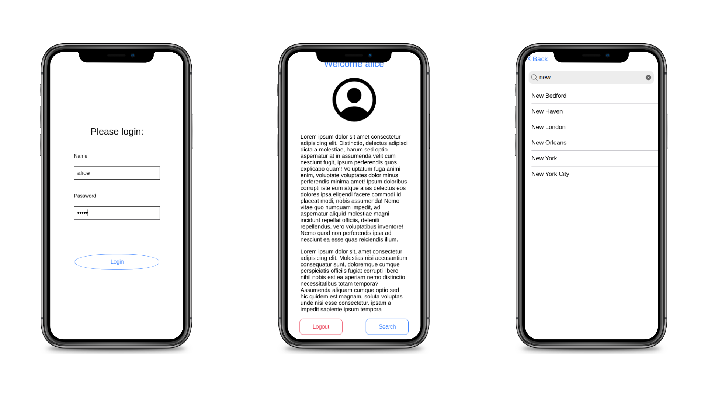

# Basic Ionic App

Basic app created using Angular, Typescript and Ionic (UI Components + capacitor for creating native ios and Android projects).

App has login page, basic user dashboard and search page to search through cities.

For successful login, user has to insert name and password (which corresponds now to reversed name). Button for login is active just when there is something inserted in both inputs (name and password). If the combination of password and name is wrong, the screen has red background.

On the Dashboard page, users name is displayed, in future there can be also photo. In the footer of this page is fixed toolbar with navigation (logout and go to search), that stays on the place although the whole page is scrolled.

On the search page, the list of the US cities is displayed. After typing to the searchbar, the cities are filtered accordingly to the search term (the cities that are displayed contains searched term). After clearing searchbar, all of the cities are once again displayed.

## Implementation details

Angular services (user and auth) are used for sharing data between individual pages.

User object, that is stored in the user service, has its own model, that defines its structure. Therefore it can be in future easily changed (another properties can be add) without necessity to go through the whole code (only places needed to be changed are user model and user service).

Routes for dashboard and search pages are protected using Authentication guard - without successful login, user can not reach them.

Cities for list in search page are dynamically displayed from array. In future it is possible to easily add request to some API to get for example cities in users current state.......

Native projects for ios and Android were created but not deployed.

**Used technologies:** Angular, Typescript, Ionic, SASS, HTML

